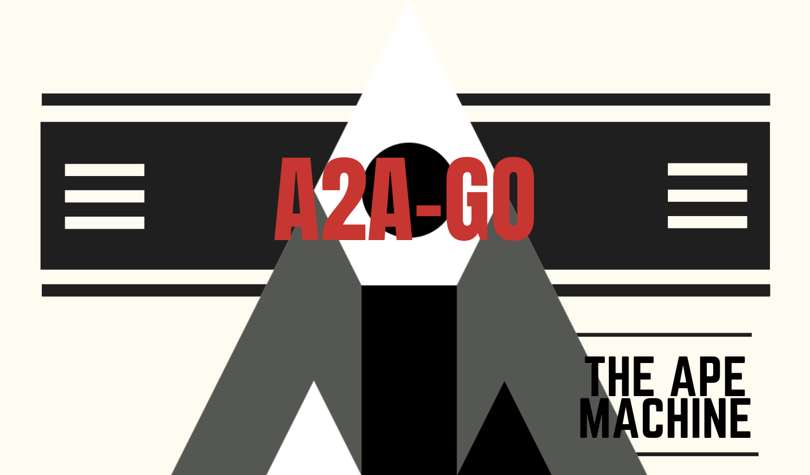

# 🌈 A2A‑Go

> _"Combine A2A and MCP to create advanced agentic systems!"_



**a2a‑go** is a reference Go implementation of the [**Agent‑to‑Agent (A2A)**
protocol](https://google.github.io/A2A/#/) by Google, including the proposed
interoperability with the [**Model Context Protocol (MCP)**](https://modelcontextprotocol.io).

> 🚧 **Work in progress** 🚧 Consider this project a proof of concept at best, and subject
> to sudden changes.

## ✨ Features

- [ ] **Agent‑to‑Agent (A2A)** protocol implementation

  - [x] _Send Task_ to send a new task to an agent
  - [ ] _Get Task_ to retrieve a task by ID 🔜
  - [ ] _Cancel Task_ to cancel a task 🔜
  - [ ] _Stream Task_ to stream the task results 🔜
  - [ ] _Set Push Notification_ to configure push notifications for a task 🔜
  - [ ] _Get Push Notification_ to retrieve the push notification configuration for a task 🔜

- [ ] **Model Context Protocol (MCP)** interoperability

  - [x] _Tool Calling_ to call tools and receive the results 🔜
  - [ ] _List Prompts_ to retrieve a list of prompts from an agent 🔜
  - [ ] _Get Prompt_ to retrieve a prompt by ID 🔜
  - [ ] _Set Prompt_ to create or update a prompt 🔜
  - [ ] _Delete Prompt_ to delete a prompt by ID 🔜

- [ ] **Built‑in tools**

  - [ ] _Browser_ to browse the web 🔜
  - [ ] _Docker_ to run Docker commands 🔜
  - [ ] _GitHub_ to search GitHub 🔜
  - [ ] _Memory_ to store and retrieve memories 🔜
  - [ ] _Qdrant_ to store and retrieve vectors 🔜
  - [ ] _Neo4j_ to store and retrieve graph data 🔜

---

## 🚀 Quick Start

Run the `docker-compose.yml` for a full distributed system, demonstrating
A2A and MCP interoperability.

```bash
docker compose up
```

To run individual, more contained examples, use the `example` cli command.

```bash
a2a-go example <example-name>
```

Add the `--interactive` flag to run the example in interactive mode.

```bash
a2a-go example <example-name> --interactive
```

All example code lives in the [`examples`](examples) directory.
