# 🌈 A2A‑Go

> _"Combine A2A and MCP to create advanced, distributed agentic systems!"_

A2A-Go is a comprehensive framework for building scalable, distributed agentic AI systems with built-in VPN capabilities. It promotes a microservice architecture where agents and tools operate as independent services, deployable locally or across a network. The framework implements the Agent-to-Agent (A2A) protocol and utilizes the Model Context Protocol (MCP) for standardized tool interaction and data exchange.

[](https://github.com/theapemachine/a2a-go/actions/workflows/main.yml)
[](https://goreportcard.com/report/github.com/theapemachine/a2a-go)
[](https://godoc.org/github.com/theapemachine/a2a-go)
[](https://opensource.org/licenses/MIT)
[](https://sonarcloud.io/summary/new_code?id=TheApeMachine_a2a-go)
[](https://sonarcloud.io/summary/new_code?id=TheApeMachine_a2a-go)
[](https://sonarcloud.io/summary/new_code?id=TheApeMachine_a2a-go)
[](https://sonarcloud.io/summary/new_code?id=TheApeMachine_a2a-go)
[](https://sonarcloud.io/summary/new_code?id=TheApeMachine_a2a-go)
[](https://sonarcloud.io/summary/new_code?id=TheApeMachine_a2a-go)
[](https://sonarcloud.io/summary/new_code?id=TheApeMachine_a2a-go)
[](https://sonarcloud.io/summary/new_code?id=TheApeMachine_a2a-go)
[](https://sonarcloud.io/summary/new_code?id=TheApeMachine_a2a-go)


**a2a‑go** is a reference Go implementation of the [**Agent‑to‑Agent (A2A)**
protocol](https://google.github.io/A2A/#/) by Google, including the proposed
interoperability with the [**Model Context Protocol (MCP)**](https://modelcontextprotocol.io).

> 🚧 **Work in progress** 🚧 Consider this project a proof of concept at best, and subject
> to sudden changes.

## 📋 Table of Contents

- [Features](#-features)
- [Architecture](#-architecture)
- [Prerequisites](#-prerequisites)
- [Quick Start](#-quick-start)
- [Installation](#-installation)
- [Usage](#-usage)
- [VPN Capabilities](#-vpn-capabilities)
- [Built-in Tools](#-built-in-tools)
- [Agent Ecosystem](#-agent-ecosystem)
- [Configuration](#-configuration)
- [Development](#-development)
- [Contributing](#-contributing)
- [Documentation](#-documentation)

## ✨ Features

### 🔌 Agent‑to‑Agent (A2A) Protocol Implementation

- [x] **Task Management**
  - [x] _Send Task_ to send a new task to an agent
  - [x] _Get Task_ to retrieve a task by ID
  - [x] _Cancel Task_ to cancel a task
  - [x] _Stream Task_ to stream the task results
  - [x] _Set Push Notification_ to configure push notifications for a task
  - [x] _Get Push Notification_ to retrieve the push notification configuration for a task

- [x] **Advanced AI Capabilities**
  - [x] _Structured Outputs_ to return structured data from an agent
  - [x] _Fine‑tuning_ to fine‑tune an agent on a dataset
  - [x] _Image Generation_ to generate images with an agent
  - [x] _Audio Transcription_ to transcribe audio
  - [x] _Text‑to‑Speech_ to convert text to speech

### 🛠️ Model Context Protocol (MCP) Interoperability

- [x] **Prompt Management**
  - [x] _List Prompts_ to retrieve a list of prompts from an agent
  - [x] _Get Prompt_ to retrieve a prompt by ID
  - [x] _Set Prompt_ to create or update a prompt
  - [x] _Delete Prompt_ to delete a prompt by ID

- [x] **Resource Management**
  - [ ] _List Resources_ to retrieve a list of resources from an agent
  - [ ] _Get Resource_ to retrieve a resource by ID
  - [ ] _Set Resource_ to create or update a resource
  - [ ] _Delete Resource_ to delete a resource by ID

- [x] **Tool Calling & Sampling**
  - [x] _Tool Calling_ to call tools and receive the results
  - [x] _Sampling_ to sample a task from an agent
  - [x] _Roots_ to get the root task for a task

### 🔐 VPN & Networking

- [x] **WireGuard VPN Integration**
  - [x] Built-in VPN client using WireGuard protocol
  - [x] SOCKS5 proxy support for browser tool
  - [x] Network stack integration with gVisor
  - [x] Browser network context switching

### 🏗️ Infrastructure & Deployment

- [x] **Containerized Architecture**
  - [x] Docker Compose orchestration
  - [x] Kubernetes deployment manifests
  - [x] MinIO object storage integration
  - [x] Service discovery and registration

- [x] **Enterprise Integration**
  - [x] Azure DevOps complete integration suite
  - [x] GitHub API integration
  - [x] Slack notifications and webhooks
  - [x] OAuth2 authentication system

## 🏛️ Architecture

A2A-Go implements a distributed microservice architecture where each component runs independently:

```mermaid
%%{init: {"flowchart": {"defaultRenderer": "elk"}}}%%
graph TB
    subgraph "A2A-Go Distributed Architecture"
        subgraph "Service Layer"
            Catalog["🗂️ Catalog Service<br/>:3210<br/>(Registry)"]
            Manager["🤖 Manager Agent<br/>:8080<br/>(Orchestrator)"]
            Planner["📋 Planner Agent<br/>:8081<br/>(Strategy)"]
            Researcher["🔍 Researcher Agent<br/>:8082<br/>(Intel)"]
            Developer["💻 Developer Agent<br/>:8083<br/>(Code)"]
        end
        
        subgraph "Tool Layer"
            Browser["🌐 Browser Tool<br/>:9001<br/>(Web Automation)"]
            Docker["🐳 Docker Tool<br/>:9002<br/>(Containers)"]
            Azure["☁️ Azure DevOps<br/>:9003<br/>(Enterprise)"]
            GitHub["🐙 GitHub Tool<br/>:9004<br/>(Source Control)"]
        end
        
        subgraph "Infrastructure Layer"
            MinIO["📦 MinIO Storage<br/>:9000<br/>(Object Store)"]
            VPN["🔐 VPN Layer<br/>(WireGuard + SOCKS5)<br/>Browser Network Context"]
            UI["💻 Terminal UI<br/>(Interactive Client)"]
        end
    end
    
    %% Service Discovery
    Catalog -.-> Manager
    Catalog -.-> Planner
    Catalog -.-> Researcher
    Catalog -.-> Developer
    
    %% Agent Coordination
    Manager --> Planner
    Manager --> Researcher
    Manager --> Developer
    Planner --> Developer
    Researcher --> Developer
    
    %% Tool Usage
    Manager -.-> Browser
    Manager -.-> Docker
    Manager -.-> Azure
    Manager -.-> GitHub
    
    Developer -.-> Browser
    Developer -.-> Docker
    Developer -.-> GitHub
    
    Researcher -.-> Browser
    Researcher -.-> GitHub
    
    %% Infrastructure
    Manager --> MinIO
    Planner --> MinIO
    Researcher --> MinIO
    Developer --> MinIO
    
    UI --> Catalog
    UI --> Manager
    
    %% VPN for Browser Tool Only
    Browser --> VPN
    
    style Catalog fill:#e1f5fe
    style Manager fill:#f3e5f5
    style Planner fill:#f3e5f5
    style Researcher fill:#f3e5f5
    style Developer fill:#f3e5f5
    style Browser fill:#fff3e0
    style Docker fill:#fff3e0
    style Azure fill:#fff3e0
    style GitHub fill:#fff3e0
    style MinIO fill:#e8f5e8
    style VPN fill:#ffebee
    style UI fill:#f1f8e9
```



### Core Components

- **Catalog Service**: Central registry for agent and tool discovery
- **Agent Services**: Specialized AI agents (Manager, Planner, Researcher, Developer, etc.)
- **Tool Services**: Standalone tools exposing specific capabilities
- **VPN Layer**: Network context switching for browser tool using WireGuard protocol
- **Storage Layer**: MinIO for object storage and task persistence
- **UI Layer**: Terminal UI for interaction and testing

## 📋 Prerequisites

- **Go 1.24.2** or later
- **Docker** and **Docker Compose**
- **Make** (for build automation)

### Optional Dependencies

- **Kubernetes** (for K8s deployment)
- **WireGuard** (for VPN functionality)
- **MinIO** client (for storage management)

## 🚀 Quick Start

The fastest way to get started is using the provided Makefile to run a full containerized distributed system:

### 1. Start the Server Infrastructure

```bash
# Build and start all services
make server
```

This will:
- Build the Docker image
- Start the catalog service on port `3210`
- Launch all agent and tool services
- Initialize MinIO storage
- Set up the VPN infrastructure

### 2. Connect with the Client

```bash
# Run the Terminal UI client
make client
```

The Terminal UI will connect to the distributed system and provide an interactive interface for:
- Browsing available agents and tools
- Sending tasks to agents
- Streaming real-time results
- Managing agent workflows

### 3. Test the System

```bash
# Run automated tests
make test
```

## 📦 Installation

### From Source

```bash
# Clone the repository
git clone https://github.com/theapemachine/a2a-go.git
cd a2a-go

# Build the binary
go build -o a2a-go main.go

# Run a specific command
./a2a-go --help
```

### Using Docker

```bash
# Build the Docker image
docker build -t theapemachine/a2a-go:latest .

# Run a specific agent
docker run -it --rm theapemachine/a2a-go:latest ui
```

## 🎯 Usage

### Basic Agent Communication

```bash
# Send a task to an agent via JSON-RPC
curl -s -X POST localhost:8080/rpc \
  -d '{"jsonrpc":"2.0","id":1,"method":"tasks/send","params":{"id":"t1","message":{"role":"user","parts":[{"type":"text","text":"Hello"}]}}}' \
  | jq .artifacts[0].parts[0].text
```

### Streaming Events

```bash
# Connect to Server-Sent Events stream
curl -sN localhost:3210/events | jq -c
```

### Using Tools

```bash
# List available prompts
curl -s -X POST localhost:3210/rpc \
  -d '{"jsonrpc":"2.0","id":2,"method":"prompts/list"}' \
  | jq .prompts

# Fetch specific prompt content
curl -s -X POST localhost:3210/rpc \
  -d '{"jsonrpc":"2.0","id":3,"method":"prompts/get","params":{"name":"Greeting"}}' \
  | jq .messages[0].content.text
```

## 🔐 VPN Capabilities

A2A-Go includes a VPN solution built on WireGuard specifically for the browser tool:

### Features

- **WireGuard Integration**: Native WireGuard protocol support
- **SOCKS5 Proxy**: Built-in SOCKS5 proxy server for browser traffic
- **Network Stack**: Custom network stack using gVisor
- **Network Context Switching**: Allows browser tool to operate from different network endpoints

### Configuration

VPN settings are managed through the `a2a.conf` file:

```ini
[Interface]
PrivateKey = your_private_key_here
Address = 10.0.0.1/24

[Peer]
PublicKey = peer_public_key_here
Endpoint = vpn.example.com:51820
AllowedIPs = 10.0.0.0/24
```

## 🛠️ Built-in Tools

A2A-Go comes with an extensive set of pre-built tools:

### Web & Browser Tools
- **Browser**: Headless browser automation with Rod
- **Fetch**: Web content extraction and screenshot capture
- **GitHub**: Repository search and content retrieval

### Development Tools
- **Docker**: Container management and deployment
- **Azure DevOps**: Complete sprint and work item management
- **Catalog**: Agent and service discovery

### Data & Storage Tools
- **Memory**: Persistent memory storage for agents
- **Qdrant**: Vector database integration
- **Neo4j**: Graph database operations

### Communication Tools
- **Slack**: Notification and webhook integration
- **Editor**: File editing and manipulation

## 🤖 Agent Ecosystem

The framework includes several specialized agents:

- **Manager**: Orchestrates tasks and coordinates other agents
- **Planner**: Creates and manages project plans
- **Researcher**: Gathers information and conducts research
- **Developer**: Handles code generation and development tasks
- **Evaluator**: Assesses and validates agent outputs
- **UI**: Provides terminal-based user interface

Each agent is containerized and can be deployed independently or as part of the complete ecosystem.

## ⚙️ Configuration

### Environment Variables

Create a `.env` file based on `env.example`:

```bash
# MinIO Configuration
MINIO_USER=minioadmin
MINIO_PASSWORD=minioadmin
AWS_ACCESS_KEY_ID=a2a-access-key
AWS_SECRET_ACCESS_KEY=a2a-secret-key

# API Keys
OPENAI_API_KEY=your_openai_key
ANTHROPIC_API_KEY=your_anthropic_key
COHERE_API_KEY=your_cohere_key

# Azure DevOps
AZURE_DEVOPS_ORGANIZATION=your_org
AZURE_DEVOPS_TOKEN=your_token
```

### Agent Configuration

The system uses a hierarchical configuration approach:

1. **Embedded Defaults**: Built into the binary
2. **User Config**: `~/.a2a-go/config.yml`
3. **Environment Variables**: Override specific settings

## 🔧 Development

### Project Structure

```
a2a-go/
├── cmd/              # CLI commands and entry points
├── pkg/              # Core packages
│   ├── a2a/          # A2A protocol implementation
│   ├── vpn/          # VPN and networking
│   ├── tools/        # Built-in tools
│   ├── ui/           # Terminal UI
│   └── ...
├── docs/             # Documentation
├── specs/            # Protocol specifications
└── docker-compose.yml
```

### Running Tests

```bash
# Run all tests
go test ./...

# Run with coverage
go test -cover ./...

# Run specific test suite
go test ./pkg/tools/...
```

### Code Style

- Use **GoDoc** comments above all methods and types
- Follow the `/**/` format for documentation
- Use **GoConvey** for tests with one test function per code function
- Maintain clean, well-organized code structure

## 🤝 Contributing

1. **Read the Specifications**: Check the `specs/` directory for protocol details
2. **Follow Code Style**: Maintain consistency with existing patterns
3. **Write Tests**: Use GoConvey and mirror code structure in tests
4. **Update Documentation**: Keep docs current with changes
5. **Test the TUI**: Ensure Terminal UI works with your changes

### Development Workflow

```bash
# Start development environment
make server

# Make your changes
# ...

# Test your changes
make test

# Test with client
make client
```

## 📚 Documentation

Comprehensive documentation is available in the `docs/` directory:

- **[Quick Start Guide](docs/quickstart.md)**: Get up and running quickly
- **[Architecture Overview](docs/architecture.md)**: System design and components  
- **[Tools Documentation](docs/tools.md)**: Built-in tools and capabilities
- **[Memory Architecture](docs/memory-architecture.md)**: Agent memory systems
- **[Prompts Guide](docs/prompts.md)**: Prompt management and usage
- **[Sampling Documentation](docs/sampling.md)**: Task sampling strategies
- **[Resources Guide](docs/resources.md)**: Resource management

### Protocol Specifications

The `specs/` directory contains detailed protocol specifications:

- **A2A Protocol**: Complete Agent-to-Agent specification
- **MCP Integration**: Model Context Protocol implementation details
- **Tool Definitions**: Comprehensive tool capability specifications

## 📄 License

This project is released under the [UNLICENSE](LICENSE), placing it in the public domain.

## 🔗 Links

- [Agent-to-Agent Protocol](https://google.github.io/A2A/#/)
- [Model Context Protocol](https://modelcontextprotocol.io)
- [Go Documentation](https://godoc.org/github.com/theapemachine/a2a-go)
- [Docker Hub](https://hub.docker.com/r/theapemachine/a2a-go)

---

> **Note**: This is an active development project implementing cutting-edge agent protocols. The API and features may change as the specifications evolve.
