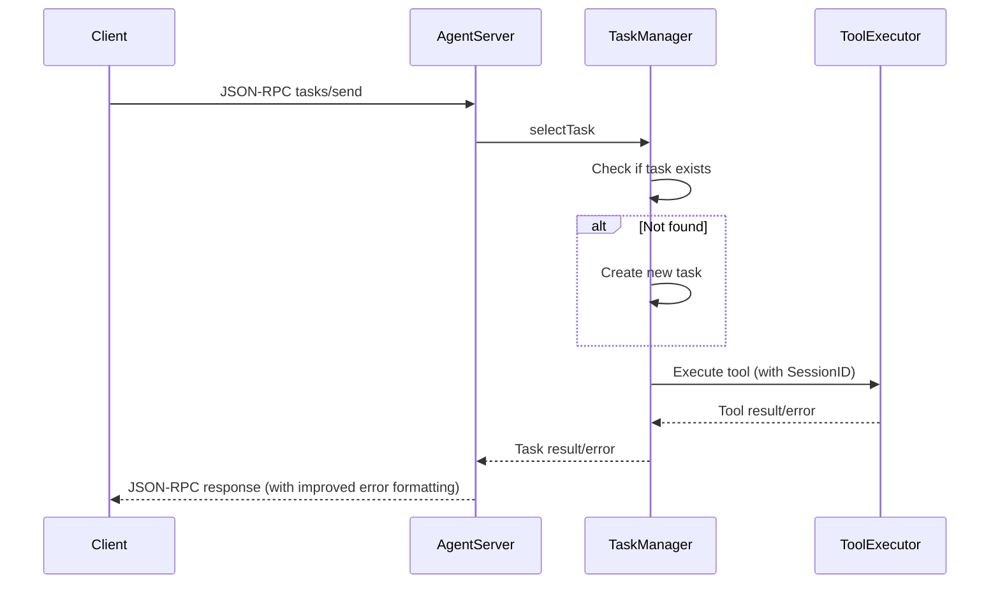

```mermaid
sequenceDiagram
    participant Client
    participant AgentServer
    participant TaskManager
    participant ToolExecutor

    Client->>AgentServer: JSON-RPC tasks/send
    AgentServer->>TaskManager: selectTask
    TaskManager->>TaskManager: Check if task exists
    alt Not found
        TaskManager->>TaskManager: Create new task
    end
    TaskManager->>ToolExecutor: Execute tool (with SessionID)
    ToolExecutor-->>TaskManager: Tool result/error
    TaskManager-->>AgentServer: Task result/error
    AgentServer-->>Client: JSON-RPC response (with improved error formatting)
```
