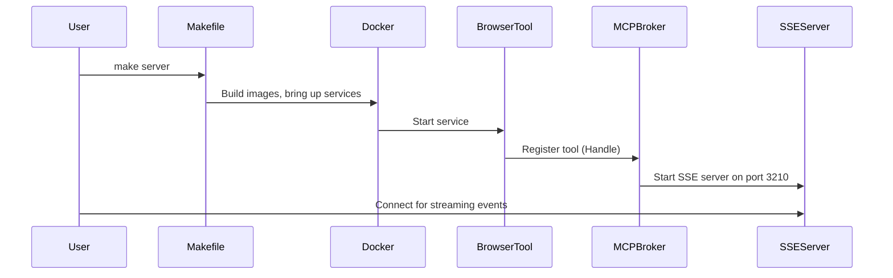

```mermaid
sequenceDiagram
    participant User
    participant Makefile
    participant Docker
    participant BrowserTool
    participant MCPBroker
    participant SSEServer

    User->>Makefile: make server
    Makefile->>Docker: Build images, bring up services
    Docker->>BrowserTool: Start service
    BrowserTool->>MCPBroker: Register tool (Handle)
    MCPBroker->>SSEServer: Start SSE server on port 3210
    User->>SSEServer: Connect for streaming events
```
