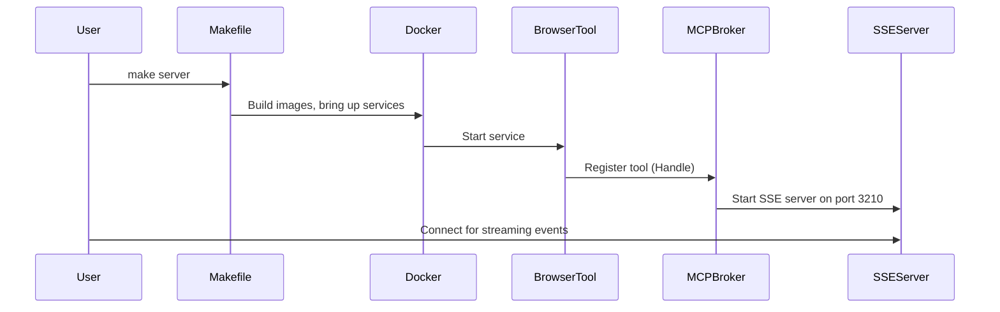
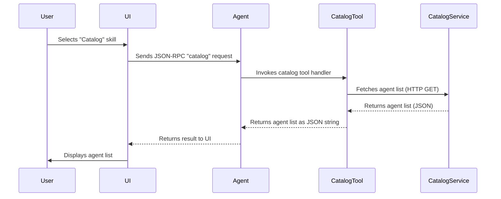
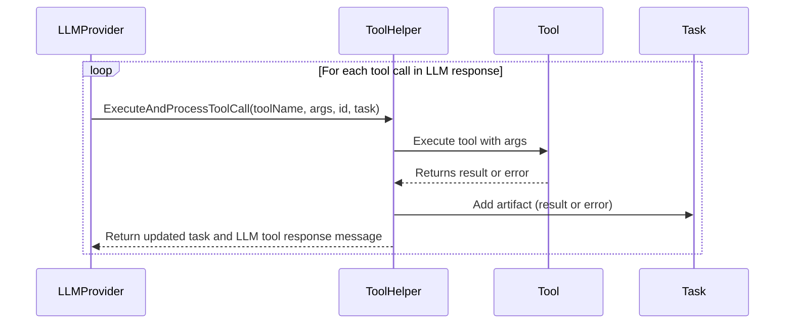

# Skills & Tools

The a2a-go framework automatically converts skills, as defined in the agent-to-agent spec, into tools, compatible with most LLM provider's tool calling APIs.

```mermaid
sequenceDiagram
    participant User
    participant Makefile
    participant Docker
    participant BrowserTool
    participant MCPBroker
    participant SSEServer

    User->>Makefile: make server
    Makefile->>Docker: Build images, bring up services
    Docker->>BrowserTool: Start service
    BrowserTool->>MCPBroker: Register tool (Handle)
    MCPBroker->>SSEServer: Start SSE server on port 3210
    User->>SSEServer: Connect for streaming events
```

```mermaid
sequenceDiagram
    participant User
    participant UI
    participant Agent
    participant CatalogTool
    participant CatalogService

    User->>UI: Selects "Catalog" skill
    UI->>Agent: Sends JSON-RPC "catalog" request
    Agent->>CatalogTool: Invokes catalog tool handler
    CatalogTool->>CatalogService: Fetches agent list (HTTP GET)
    CatalogService-->>CatalogTool: Returns agent list (JSON)
    CatalogTool-->>Agent: Returns agent list as JSON string
    Agent-->>UI: Returns result to UI
    UI->>User: Displays agent list
```

```mermaid
sequenceDiagram
    participant LLMProvider
    participant ToolHelper
    participant Tool
    participant Task

    loop For each tool call in LLM response
        LLMProvider->>ToolHelper: ExecuteAndProcessToolCall(toolName, args, id, task)
        ToolHelper->>Tool: Execute tool with args
        Tool-->>ToolHelper: Returns result or error
        ToolHelper->>Task: Add artifact (result or error)
        ToolHelper-->>LLMProvider: Return updated task and LLM tool response message
    end
```
